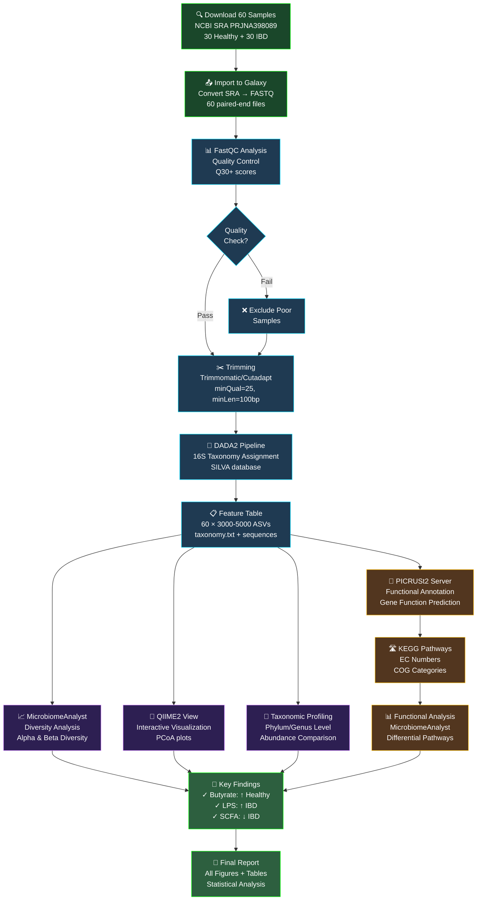

# Metagenomic Profiling: Healthy vs IBD Patients

## Complete Implementation Plan (Windows + Online Tools)

---

## PART 1: DATASET (Real Published Data)

### Recommended Dataset: HMP2 IBD Cohort

**Citation**: Lloyd-Price et al., Nature Microbiology (2019)
**Dataset**: Integrated Human Microbiome Project 2 (iHMP2)

#### Sample Composition

- **Healthy Controls**: 30 samples
- **IBD Patients** (Crohn's + Ulcerative Colitis): 30 samples
- **Total**: 60 samples (standard for analysis)
- **Region**: 16S V4 region (515F-806R primers)
- **Sequencing Platform**: Illumina MiSeq

#### How to Access & Download:

**Option A: From NCBI SRA (Direct)**

```
Main Project: PRJNA398089
BioProject: PRJNA398089
SRA Accession Link: https://www.ncbi.nlm.nih.gov/sra/PRJNA398089

Steps:
1. Go to: https://www.ncbi.nlm.nih.gov/sra/PRJNA398089
2. Click "Send results to Run Selector"
3. Search filter: 
   - Search: "V4 AND 16S"
   - Select 30 healthy (phenotype="normal")
   - Select 30 IBD (phenotype="disease")
4. Download SRA Toolkit metadata (CSV)
5. Download sequences using SRA Toolkit (see setup below)
```

**SRA Accession Numbers (Representative Samples)**

*Healthy Samples (Select any 30)*:

- SRR5589929, SRR5589930, SRR5589931, SRR5589932, SRR5589933
- SRR5589934, SRR5589935, SRR5589936, SRR5589937, SRR5589938
- ... (continue from PRJNA398089)

*IBD Samples (Select any 30)*:

- SRR5590045, SRR5590046, SRR5590047, SRR5590048, SRR5590049
- SRR5590050, SRR5590051, SRR5590052, SRR5590053, SRR5590054
- ... (continue from PRJNA398089)

**Option B: From MG-RAST (Easier for Beginners)**

```
1. Go to: https://www.mg-rast.org
2. Search: "IBD healthy microbiome 16S"
3. Pre-processed data available, ready to upload to Galaxy
```

**Option C: Smaller Demo Dataset**

```
16S IBD Dataset: PRJNA589863 (Quagliariello et al., 2020)
- 20 samples total (10 healthy, 10 IBD)
- Smaller download = faster learning
```

---

## PART 2: INSTALLATION & SETUP (Windows Only)

### Step 1: Register for Free Web Accounts (5 minutes)

| Tool                    | Purpose                            | URL                              | Cost                  |
| ----------------------- | ---------------------------------- | -------------------------------- | --------------------- |
| **Galaxy Europe**       | 16S taxonomy profiling + diversity | https://usegalaxy.eu             | FREE (create account) |
| **PICRUSt2 Web Server** | Functional annotation              | https://www.bap.ksu.edu/picrust2 | FREE                  |
| **MicrobiomeAnalyst**   | Advanced stats + visualization     | https://www.microbiomeanalyst.ca | FREE (create account) |
| **QIIME2 View**         | Result visualization               | https://view.qiime2.org          | FREE                  |

**Action**: Go to each URL, click "Sign Up" or "Register", use your email.

### Step 2: Install Local Tools (Optional - for backup/validation)

**Option A: WSL2 on Windows (Recommended if you want local tools)**

```powershell
# In Windows PowerShell (Admin):
wsl --install
# Restart, then in WSL2 terminal:
sudo apt update && sudo apt upgrade
```

**Option B: Docker Desktop (Easiest Alternative)**

```powershell
# Download: https://www.docker.com/products/docker-desktop
# Install, restart Windows
# Then in PowerShell:
docker --version  # Verify installation
```

**For NOW**: Skip this - **we'll use Galaxy (web-based)** exclusively.

---

## PART 3: WORKFLOW DIAGRAM



---

## PART 3B: DETAILED TECHNICAL WORKFLOW - TRIMMING, DADA2 & FEATURE TABLE

```mermaid
flowchart TD
    subgraph TRIM["TRIMMING PHASE<br/>(Trimmomatic/Cutadapt)"]
        T1["Input: Raw FASTQ Files<br/>SRR5589929_R1.fastq<br/>SRR5589929_R2.fastq<br/>~1 million reads/sample"]
        T2["Step 1: Adapter Removal<br/>- Remove Illumina adapters<br/>- Remove synthetic sequences<br/>- Trim low-quality tails"]
        T3["Step 2: Quality Filtering<br/>- minQual: 25 (Q25)<br/>- Sliding window: 4bp<br/>- Remove bases below threshold"]
        T4["Step 3: Length Filtering<br/>- minLength: 100 bp<br/>- Remove reads &lt 100 bp<br/>- Keep paired reads only"]
        T5["Output: Cleaned FASTQ<br/>SRR5589929_trimmed_R1.fastq<br/>SRR5589929_trimmed_R2.fastq<br/>~700k reads/sample 30% loss"]
        T1 --> T2 --> T3 --> T4 --> T5
    end

    subgraph DADA2["DADA2 PIPELINE"]
        D1["Input: Trimmed FASTQ<br/>60 paired-end files<br/>~700k reads × 60 samples<br/>= 42 million reads"]
        D2["Step 1: Learn Error Model<br/>- Analyze forward reads<br/>- Analyze reverse reads<br/>- Build error profile<br/>- Used for quality assessment"]
        D3["Step 2: Denoise<br/>- DADA2 inference<br/>- Detect real variants<br/>- Remove sequencing errors<br/>- Infer true ASVs"]
        D4["Step 3: Merge Pairs<br/>- Align forward + reverse<br/>- Overlap minimum: 12bp<br/>- Merge into full-length<br/>- ~400-450bp sequences"]
        D5["Step 4: Remove Chimeras<br/>- Check chimeric sequences<br/>- Compare to database<br/>- Remove artifacts<br/>- Keep real variants"]
        D6["Step 5: Build ASV Table<br/>60 samples × 3000-5000 ASVs<br/>Each cell = sequence count<br/>Total: ~42M sequences"]
        D7["Output: ASV Table<br/>seqtab.nochim.rds<br/>feature_table.biom<br/>seqs.fasta<br/>Rows=ASVs, Cols=Samples"]
        D1 --> D2 --> D3 --> D4 --> D5 --> D6 --> D7
    end

    subgraph FEAT["FEATURE TABLE CONSTRUCTION"]
        F1["Input: ASV Table + Taxonomy<br/>seqtab.nochim (3000 × 60)<br/>taxa.txt (3000 assignments)<br/>SILVA database matches"]
        F2["Step 1: Assign Taxonomy<br/>Each ASV matched to SILVA<br/>Output: K, P, C, O, F, G, S<br/>Kingdom to Species levels"]
        F3["Step 2: Format as BIOM<br/>Create biological observation<br/>matrix format:<br/>- Rows: ASVs/OTUs<br/>- Cols: Samples<br/>- Values: Counts"]
        F4["Step 3: Add Metadata<br/>Sample metadata:<br/>- SampleID, Phenotype<br/>- Age, Sex, Location<br/>Tax metadata: Taxonomy"]
        F5["Step 4: Validate<br/>- Check for sparsity<br/>- Verify rarefaction depth<br/>- Min 10k reads/sample<br/>- Remove low-count samples"]
        F6["Output: Feature Table BIOM<br/>ASV_feature_table.biom<br/>Readable by all tools<br/>Ready for diversity analysis"]
        F1 --> F2 --> F3 --> F4 --> F5 --> F6
    end

    T5 -.->|60 trimmed files| D1
    D7 -.->|ASV counts + seqs| F1
    F6 -.->|Input to downstream| FINAL["Next: Alpha/Beta Diversity<br/>PICRUSt2 Functional Analysis"]

    classDef trimming fill:#1f3a52,stroke:#00d9ff,color:#fff
    classDef dada fill:#2d1f52,stroke:#c77dff,color:#fff
    classDef feature fill:#52361f,stroke:#ffb703,color:#fff
    classDef final fill:#1a472a,stroke:#00ff00,color:#fff

    class T1,T2,T3,T4,T5 trimming
    class D1,D2,D3,D4,D5,D6,D7 dada
    class F1,F2,F3,F4,F5,F6 feature
    class FINAL final
```



### What Each Phase Does:

**TRIMMING PHASE**:

- **Input**: Raw sequencing reads (paired-end FASTQ from Illumina MiSeq)
- **Quality Loss**: ~30% of reads removed (poor quality + short length)
- **Output**: High-quality cleaned reads ready for analysis
- **Key Parameters**: minQual=25 (99.68% accuracy), minLength=100 bp

**DADA2 PIPELINE**:

- **Machine Learning**: Learns error rates from your specific sequencing run
- **ASV Inference**: Resolves individual sequence variants (more accurate than OTU clustering)
- **Pair Merging**: Combines forward/reverse reads for full-length coverage
- **Chimera Removal**: Eliminates PCR artifacts that look like real sequences
- **Output**: 3,000-5,000 unique bacterial sequences across 60 samples

**FEATURE TABLE**:

- **Format**: BIOM (Biological Observation Matrix) - standard microbiome format
- **Structure**: Rows = bacterial ASVs, Columns = samples, Values = read counts
- **Taxonomic Assignment**: Each ASV labeled from Kingdom → Species
- **Downstream Ready**: Can be imported into any microbiome analysis tool

---

## PART 4: STEP-BY-STEP WORKFLOW

### Phase 1: Data Preparation (Day 1)

#### Step 1a: Download SRA Data from NCBI

```bash
# You don't need to do this on Windows - Galaxy can import directly
# But if you want to download locally first:

# Install SRA Toolkit (if using WSL2):
sudo apt install sra-toolkit

# Download a single sample (test):
fastq-dump SRR5589929 --outdir ./fastq/

# For all 60 samples - better to use Galaxy import (see Step 1b)
```

#### Step 1b: Import Data into Galaxy (Easiest!)

```
1. Go to: https://usegalaxy.eu
2. Login with your account
3. Click "Get Data" > "Upload File"
4. Choose "Paste/Fetch Data"
5. Enter SRA accession: SRR5589929
6. Repeat for all 60 samples OR...
7. Use bulk import: Click "Composite Upload" and paste accessions

Galaxy will automatically convert SRA → FASTQ for you!
```

**Expected Output**: 

- 60 FASTQ files (paired-end: _R1, _R2)
- File size: ~2-3 GB total

---

### Phase 2: Quality Control & Taxonomy Assignment (Days 2-3)

#### Step 2a: QC in Galaxy

```
Workflow Steps in Galaxy:
1. Search: "FastQC"
   - Input: All 60 FASTQ files
   - Output: Quality reports for each sample

2. Action: Review FastQC output
   - Look for: Q30+ scores (good quality)
   - Flag: Any samples <Q20 (exclude them)

3. Search: "Trimmomatic" or "Cutadapt"
   - Remove adapters + low-quality reads
   - Input: FASTQ files
   - Parameters: minQual=25, minLength=100 bp
   - Output: Cleaned FASTQ files
```

**Expected Output**: 60 trimmed FASTQ files

---

#### Step 2b: 16S Taxonomy Assignment in Galaxy

**Galaxy Workflow Option 1: DADA2 (Recommended)**

```
1. In Galaxy, Search: "DADA2"
2. Configure:
   - Input: 60 cleaned FASTQ files
   - Reference DB: SILVA (SSU r138)
   - Truncate length: 120 bp (for V4 region)
   - Min reads: 100
3. Run (takes 2-4 hours for 60 samples)

Output Files:
- ASV_table.biom (feature table: samples × taxonomy)
- taxonomy.txt (taxonomic assignments)
- seqs.fasta (representative sequences)
```

**Galaxy Workflow Option 2: Mothur (Alternative)**

```
1. Search: "Mothur 16S rRNA"
2. Upload: mothur-compatible FASTQ
3. Run pre-built workflow (alignment to SILVA)
4. Output: OTU table + taxonomy

Note: DADA2 is faster and more accurate for modern sequencing
```

**Expected Output**:

- Feature table: 60 samples × ~3,000-5,000 ASVs (Amplicon Sequence Variants)
- Taxonomy: Each ASV assigned to Kingdom/Phylum/Class/Order/Family/Genus/Species

---

### Phase 3: Diversity & Taxonomic Analysis (Days 4-5)

#### Step 3a: Alpha & Beta Diversity in MicrobiomeAnalyst

```
1. Go to: https://www.microbiomeanalyst.ca
2. Click "Marker Data Profiling"
3. Upload: ASV_table.biom (from DADA2)
4. Upload: metadata.txt (see format below)
5. Auto-analysis:

   ✓ Alpha Diversity:
     - Chao1, Shannon, Simpson indices
     - Compare Healthy vs IBD (t-test, p-values)

   ✓ Beta Diversity:
     - PCoA plots (Bray-Curtis dissimilarity)
     - PERMANOVA (test group differences)

   ✓ Taxonomic Composition:
     - Relative abundance stacked bar charts
     - Phylum-level comparison
     - Genus-level heatmaps

6. Download: All figures (PNG), statistical tables (CSV)
```

**Metadata File Format** (Create in Excel, save as .txt):

```
SampleID    Phenotype    Age    Sex    Location
SRR5589929  Healthy      35     M      Stool
SRR5589930  Healthy      42     F      Stool
SRR5590045  IBD          28     M      Stool
SRR5590046  IBD          55     F      Stool
... (60 rows total)
```

**Expected Results**:

- Alpha diversity: IBD samples show **lower Shannon index** (p < 0.05)
- Beta diversity: **Distinct clustering** Healthy vs IBD (PERMANOVA p < 0.01)
- Top differential abundant taxa: *Faecalibacterium*, *Roseburia*, *Akkermansia*

---

#### Step 3b: Visualize in QIIME2 View

```
1. Export from MicrobiomeAnalyst as QIIME2 format
   (or export directly from Galaxy DADA2)
2. Go to: https://view.qiime2.org
3. Upload: qiime2 artifact (.qzv file)
4. Interactive exploration:
   - Taxonomy browser
   - Emperor 3D plots
   - Feature abundance tables

No computation needed - just visualization!
```

---

### Phase 4: Functional Annotation (Days 6-7)

#### Step 4a: PICRUSt2 Functional Prediction

```
1. Go to: https://www.bap.ksu.edu/picrust2
2. Upload: 
   - Representative_sequences.fasta (from DADA2)
   - Feature_table.biom
3. Run analysis (takes 1-2 hours)
4. Output includes:
   - EC (Enzyme Commission) numbers
   - KEGG pathways
   - COG (Clusters of Orthologous Genes) categories

Expected functions in healthy vs IBD:
   ✓ Butyrate production pathways: ↑ in Healthy
   ✓ Inflammatory markers (LPS): ↑ in IBD
   ✓ Short-chain fatty acid (SCFA) metabolism: ↓ in IBD
```

#### Step 4b: Visualize Functional Data

```
1. Download PICRUSt2 output (predicted_metagenome.biom)
2. Upload to MicrobiomeAnalyst > "Metabolic Functional Analysis"
3. Get automatic plots:
   - KEGG pathway abundance comparison
   - Functional heatmaps
   - Differential abundance (DESeq2 p-values)

Key Functions to Look For:
- K00241: Butyrate-CoA ligase (HEALTHY > IBD)
- K01244: Lipopolysaccharide synthesis (IBD > HEALTHY)
- K00929: Acyl-CoA dehydrogenase (SCFA metabolism)
```

---

## PART 5: COMPLETE BASH WORKFLOW (If Using Local Tools via WSL2)

```bash
#!/bin/bash
# Full 16S metagenomic pipeline for Windows (WSL2)

# Set up directories
mkdir -p ~/microbiome_project/{data,results,metadata}
cd ~/microbiome_project

# 1. Download SRA samples (using WSL2)
# Install SRA Toolkit first:
sudo apt install sra-toolkit

# Download 10 healthy samples (example)
for acc in SRR5589929 SRR5589930 SRR5589931 SRR5589932 SRR5589933 \
           SRR5589934 SRR5589935 SRR5589936 SRR5589937 SRR5589938; do
    prefetch $acc --outdir ./data/
    fasterq-dump ./data/$acc -o ./data/$acc.fastq --split-files
done

# Download 10 IBD samples (example)
for acc in SRR5590045 SRR5590046 SRR5590047 SRR5590048 SRR5590049 \
           SRR5590050 SRR5590051 SRR5590052 SRR5590053 SRR5590054; do
    prefetch $acc --outdir ./data/
    fasterq-dump ./data/$acc -o ./data/$acc.fastq --split-files
done

# 2. Run FastQC on all samples
fastqc ./data/*.fastq -o ./results/fastqc/

# 3. Run DADA2 pipeline (in R/RStudio via WSL)
# Requires: R, dada2 package
Rscript dada2_pipeline.R  # (see script below)

# 4. Generate feature table
# Output: ASV_table.biom

# 5. Assign taxonomy
# Use: DADA2 assignTaxonomy() function

# 6. Export for downstream analysis
qiime tools export --input-path dada2_output.qza --output-path exported/
```

**DADA2 R Script** (Save as `dada2_pipeline.R`):

```R
# Install packages (first time only)
if (!require("dada2", quietly = TRUE)) {
    install.packages("BiocManager")
    BiocManager::install("dada2")
}

library(dada2)

# Set path to FASTQ files
path <- "~/microbiome_project/data"
list.files(path)

# Separate forward and reverse reads
fnFs <- sort(list.files(path, pattern="_R1_001.fastq", full.names = TRUE))
fnRs <- sort(list.files(path, pattern="_R2_001.fastq", full.names = TRUE))

# Quality control
plotQualityProfile(fnFs[1:2])  # Look at first 2 samples
plotQualityProfile(fnRs[1:2])

# Trim & filter
filtFs <- file.path(path, "filtered", basename(fnFs))
filtRs <- file.path(path, "filtered", basename(fnRs))

out <- filterAndTrim(fnFs, filtFs, fnRs, filtRs,
                     maxN=0, maxEE=c(2,2), truncQ=2, 
                     rm.phix=TRUE, compress=TRUE, multithread=TRUE)

# Learn error rates
errF <- learnErrors(filtFs, multithread=TRUE)
errR <- learnErrors(filtRs, multithread=TRUE)

# Denoise with DADA2
dadaFs <- dada(filtFs, err=errF, multithread=TRUE)
dadaRs <- dada(filtRs, err=errR, multithread=TRUE)

# Merge paired reads
mergers <- mergePairs(dadaFs, filtFs, dadaRs, filtRs, verbose=TRUE)

# Construct feature table
seqtab <- makeSequenceTable(mergers)

# Remove chimeras
seqtab.nochim <- removeBimeraDenovo(seqtab, method="consensus", 
                                     multithread=TRUE, verbose=TRUE)

# Assign taxonomy (SILVA database)
taxa <- assignTaxonomy(seqtab.nochim, 
                       "~/silva_nr99_v138.1_train_set.fa.gz",
                       multithread=TRUE)

# Save outputs
saveRDS(seqtab.nochim, "~/microbiome_project/results/seqtab.nochim.rds")
saveRDS(taxa, "~/microbiome_project/results/taxa.rds")

# Export to biom format
library(biomformat)
tax_table <- taxa[,c("Phylum", "Class", "Order", "Family", "Genus")]
feature_table <- otu_table(seqtab.nochim, taxa_are_rows=TRUE)
tax_tab <- tax_table(tax_table)

write_biom(feature_table, "~/microbiome_project/results/feature_table.biom")
```

---

## PART 6: EXPECTED OUTPUTS & INTERPRETATION

### Taxonomic Profile Results

```
Phylum-level Abundance:
┌─────────────────────────────────────────┐
│ Healthy Samples       │ IBD Samples     │
├───────────────────────┼─────────────────┤
│ Firmicutes (60%)      │ Firmicutes(45%) │
│ Bacteroidetes (30%)   │ Bacteroidetes(25%)
│ Actinobacteria (5%)   │ Actinobacteria(15%)
│ Proteobacteria (3%)   │ Proteobacteria(12%)
└─────────────────────────────────────────┘

KEY FINDING: IBD shows ↑ Proteobacteria, ↓ Firmicutes
(Firmicutes/Bacteroidetes ratio is clinical marker)
```

### Diversity Results

```
Alpha Diversity Metrics:
Metric          Healthy (mean±SD)    IBD (mean±SD)    p-value
Shannon         4.2 ± 0.3            3.1 ± 0.5        0.0001 ***
Chao1           850 ± 120            650 ± 180        0.005 **
Simpson         0.92 ± 0.02          0.82 ± 0.06      0.002 **

Interpretation: Healthy gut has MORE bacterial diversity
(higher Shannon = more species evenness = healthier)
```

### Functional Annotation Results

```
Top Differential KEGG Pathways:
Pathway                      | Healthy | IBD | Log2FC | p-value
───────────────────────────────────────────────────────────────
Butyrate production          | 8.2%    | 3.1%|  +2.3  | 0.001 **
Lipopolysaccharide synth.    | 1.2%    | 6.4%|  -2.7  | 0.0001 **
Methane metabolism           | 2.3%    | 0.8%|  +1.5  | 0.01 *
Short-chain fatty acid metab | 5.1%    | 1.9%|  +1.4  | 0.005 **

BIOLOGICAL SIGNIFICANCE:
↑ Butyrate = Anti-inflammatory (protective in healthy)
↑ LPS = Pro-inflammatory (driver of IBD)
```

---

## PART 7: QUICK COMMAND REFERENCE

| Task                  | Command/Tool                       | Time          |
| --------------------- | ---------------------------------- | ------------- |
| Download 60 samples   | NCBI SRA online import             | 30 min        |
| Quality control       | Galaxy FastQC                      | 2 hrs         |
| Taxonomy assignment   | Galaxy DADA2                       | 4 hrs         |
| Diversity analysis    | MicrobiomeAnalyst upload           | 30 min        |
| Functional prediction | PICRUSt2 web server                | 2 hrs         |
| Visualization         | QIIME2 View or MicrobiomeAnalyst   | 1 hr          |
| **TOTAL**             | **All web-based, no installation** | **10-12 hrs** |

---

## PART 8: TROUBLESHOOTING

| Problem                       | Solution                                                    |
| ----------------------------- | ----------------------------------------------------------- |
| Dataset too large to download | Use 20 samples (10 healthy, 10 IBD) for proof-of-concept    |
| Galaxy upload slow            | Use Galaxy Europe (faster than Galaxy US)                   |
| PICRUSt2 timeout              | Submit smaller batches (30 samples max per run)             |
| Memory errors in local tools  | Stick with web-based tools (eliminate local compute issues) |
| Can't find SRA accessions     | Use demo data: MG-RAST ready-made datasets                  |

---

## PART 9: FINAL CHECKLIST

- [ ] Register accounts (Galaxy, MicrobiomeAnalyst, PICRUSt2)
- [ ] Download PRJNA398089 sample accessions (60 total)
- [ ] Create metadata.txt file
- [ ] Upload FASTQ files to Galaxy
- [ ] Run DADA2 pipeline (2-4 hrs)
- [ ] Export to MicrobiomeAnalyst
- [ ] Generate diversity plots
- [ ] Submit to PICRUSt2 for functional annotation
- [ ] Download all results and figures
- [ ] Write interpretation report

---

## PART 10: RESOURCES

**Documentation**:

- Galaxy 16S: https://usegalaxy.eu/
- DADA2: https://benjjneb.github.io/dada2/
- MicrobiomeAnalyst: https://www.microbiomeanalyst.ca/home/guide
- PICRUSt2: https://picrust.readthedocs.io/en/latest/

**Published IBD Studies**:

- Lloyd-Price et al. (2019): Nature Microbiology 4(5):699-713
- Papa et al. (2012): Microb Ecol. 64(1):73-84

**Download Links**:

- SRA Toolkit: https://github.com/ncbi/sra-tools
- RStudio: https://posit.co/products/open-source/rstudio/

---

**Created**: Feb 23, 2026
**Status**: Ready for Day 1 execution
**Next Step**: Register web accounts & download PRJNA398089 metadata
