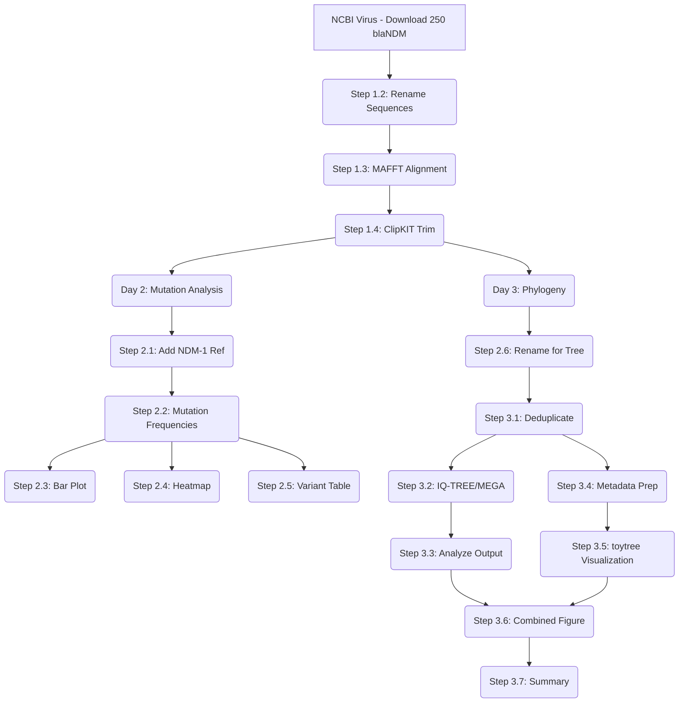

## Phylogeny and Mutation Frequency Analysis of blaNDM Gene

## Project Overview

*   **Title**: Evolutionary and Mutational Landscape of blaNDM Carbapenemase Gene: A Phylogenetic and Mutation Frequency Analysis
*   **Duration**: 3 Days
*   **Skills Demonstrated**: Multiple sequence alignment, Phylogenetic inference (ML), Mutation frequency analysis, Python scripting, Bioinformatics pipeline development, AMR surveillance, Reproducible research
*   **Outputs**: Phylogenetic tree (SVG/HTML), Mutation frequency heatmap (PNG), Combined figure, Mutation frequencies table (CSV), Full Python pipeline

---

## Tools & Software Required (All Free)

| Tool | Purpose | Link | Install Required? |
| --- | --- | --- | --- |
| NCBI | Sequence database | [https://www.ncbi.nlm.nih.gov](https://www.ncbi.nlm.nih.gov/labs/virus/vssi/#/) | No (web) |
| MAFFT | Multiple sequence alignment | [https://mafft.cbrc.jp/alignment/server/](https://mafft.cbrc.jp/alignment/server/) | No (web) |
| ClipKIT | Alignment trimming (local) | `pip install clipkit` | Yes (pip) |
| IQ-TREE / MEGA | Maximum Likelihood phylogeny | [iqtree3](https://github.com/iqtree/iqtree3/releases) / [MEGA](https://megasoftware.net/) | Yes (local/GUI) |
| toytree | Tree visualization (local Python) | `pip install toytree` | Yes (pip) |
| Python 3.12+ | Data analysis & visualization | [https://www.python.org/downloads/](https://www.python.org/downloads/) | Yes |
| BioPython | Biological sequence parsing | `pip install biopython` | Yes |
| pandas | Data manipulation | `pip install pandas` | Yes |
| matplotlib | Plotting | `pip install matplotlib` | Yes |
| seaborn | Statistical viz | `pip install seaborn` | Yes |
| NCBI Datasets CLI (optional) | Alternative bulk download | [https://www.ncbi.nlm.nih.gov/datasets/docs/v2/download-and-install/](https://www.ncbi.nlm.nih.gov/datasets/docs/v2/download-and-install/) | Optional |
| VS Code (or any editor) | Code editing | [https://code.visualstudio.com/](https://code.visualstudio.com/) | Yes (free) |

---

## Repository Structure

After completing all steps, you will have:

```
C:\Users\hp\Dev\playground\
├── data\
│   ├── blaNDM_Kpneumoniae_raw.fasta          # Downloaded from NCBI Virus
│   ├── blaNDM_Kpneumoniae_renamed.fasta       # Renamed sequences (Step 1.2)
│   ├── sequence_metadata.csv                  # Sequence metadata (Step 1.2)
│   ├── blaNDM_Kpneumoniae_aligned.fasta       # MAFFT alignment (Step 1.3)
│   ├── blaNDM_Kpneumoniae_aligned_trimmed.fasta # Trimmed alignment (Step 1.4)
│   ├── blaNDM_Kpneumoniae_phylogeny.fasta     # Renamed for tree (Step 2.6)
│   ├── mutation_frequencies.csv               # Per-position mutations (Step 2.3)
│   ├── variant_frequency_table.csv            # Variant stats (Step 2.5)
│   └── NDM-1_FN396876.fasta                  # Reference sequence (Step 2.1)
├── scripts\
│   ├── 01_rename_sequences.py                 # Rename downloaded sequences
│   ├── 02_download_reference.py               # Download NDM-1 reference
│   ├── 03_align_reference.py                  # Re-align with reference
│   ├── 04_mutation_frequencies.py             # Compute per-position mutations
│   ├── 05_plot_mutation_heatmap.py            # Heatmap of mutations
│   ├── 06_variant_frequency_table.py          # Variant frequency table
│   ├── 07_deduplicate_sequences.py            # Remove identical sequences
│   ├── 08_rename_for_phylogeny.py             # Rename for publication-ready labels
│   ├── 09_tree_visualize.py                   # toytree phylogeny visualization
│   └── 10_summary_report.py                   # Final summary report
├── figures\
│   ├── mutation_heatmap.png                   # Mutation heatmap
│   ├── mutation_bar_plot.png                  # Mutation frequency bar plot
│   ├── phylogeny_tree.svg                     # Tree visualization (vector)
│   ├── phylogeny_tree.html                    # Tree visualization (interactive)
│   └── combined_figure.png                    # Tree + heatmap combined
├── results\
│   ├── iqtree/                                # IQ-TREE output files
│   └── analysis_summary.md                    # Final summary report
└── trilium_note_backup.md                     # Backup of experiment plan
```

---

## Execution Plan (Checklist)

### Day 1: Sequence Acquisition, Alignment & Quality

- [ ] Step 1.1 — Download 250 blaNDM Sequences from NCBI Virus
- [ ] Step 1.2 — Rename Sequences for Readability
- [ ] Step 1.3 — Multiple Sequence Alignment with MAFFT
- [ ] Step 1.4 — Trim Alignment with ClipKIT

### Day 2: Mutation Frequency Analysis & Visualization

- [ ] Step 2.1 — Designate NDM-1 as Reference Sequence
- [ ] Step 2.2 — Compute Per-Position Mutation Frequencies
- [ ] Step 2.3 — Bar Plot of Mutation Frequencies
- [ ] Step 2.4 — Mutation Heatmap
- [ ] Step 2.5 — Variant Frequency Table
- [ ] Step 2.6 — Rename Alignment Headers for Phylogeny

### Day 3: Phylogenetic Analysis & Combined Figure

- [ ] Step 3.1 — Deduplicate Sequences
- [ ] Step 3.2 — Build Maximum Likelihood Phylogeny (IQ-TREE / MEGA)
- [ ] Step 3.3 — Analyze IQ-TREE Output
- [ ] Step 3.4 — Prepare Metadata for Tree Visualization
- [ ] Step 3.5 — Visualize Tree with toytree
- [ ] Step 3.6 — Create Combined Figure (Tree + Heatmap)
- [ ] Step 3.7 — Generate Summary Report

---

---

## Day 1: Sequence Acquisition, Alignment & Quality

### Step 1.1 — Download 250 blaNDM Sequences from NCBI Virus

1.  Go to [NCBI Virus — beta](https://www.ncbi.nlm.nih.gov/labs/virus/vssi/#/)
2.  Search: `Klebsiella pneumoniae AND blaNDM`
    *   Organism: *Klebsiella pneumoniae* (taxid: 573)
    *   Gene: blaNDM
    *   Database: Nucleotide
3.  Refine search (optional):
    *   `Klebsiella pneumoniae AND blaNDM AND "complete cds"`
    *   `Klebsiella pneumoniae AND blaNDM AND 800:2000[Sequence Length]`
4.  Sort by relevance → Select **250 sequences** with complete CDS
5.  **Download** → Format: **FASTA (nucleotide)** → Save as `blaNDM_Kpneumoniae_raw.fasta`
6.  Place file in: `C:\Users\hp\Dev\playground\data\`

**Key considerations:**

*   **Do not use NDM-1 as the only query** — this would miss other NDM variants (NDM-5, NDM-7, etc.)
*   **Avoid including closely related species** (e.g., *E. coli* with blaNDM) unless your research question requires cross-species comparison
*   **Check sequence length**: blaNDM is ~813 bp — sequences outside 750–900 bp may be truncated
*   **Check for KPC contamination**: The query can occasionally pull KPC sequences labeled as blaNDM. Cross-check accessions if needed.

---

### Step 1.2 — Rename Sequences for Readability

NCBI headers are long and inconsistent for downstream use. We rename them to clean, short IDs.

**What is a Python script?** A Python script is a text file (ending in `.py`) that contains instructions for the computer. You write the code in a text editor, save the file, then "run" it — the computer reads each line and follows the instructions.

**Step-by-step guide:**

1.  **Open VS Code** (or Notepad if you don't have VS Code)
    *   VS Code: Start Menu → "Visual Studio Code" → Open
    *   Notepad: Start Menu → "Notepad" → Open
2.  **Create a new file** — File → New File (Ctrl+N)
3.  **Copy-paste the following code** exactly as shown:

```python
import csv
from Bio import SeqIO

input_file = "../data/blaNDM_Kpneumoniae_raw.fasta"
output_file = "../data/blaNDM_Kpneumoniae_renamed.fasta"
metadata_file = "../data/sequence_metadata.csv"

records = []
rows = []
for i, record in enumerate(SeqIO.parse(input_file, "fasta")):
    header = record.description
    accession = header.split()[0] if " " in header else header

    parts = header.split("|")
    organism = parts[1] if len(parts) > 1 else "Unknown"
    country = parts[3] if len(parts) > 3 else "Unknown"
    year = parts[4] if len(parts) > 4 else "Unknown"

    short_id = f"KpNDM_{i+1:04d}_{country}_{year}"
    record.id = short_id
    record.description = ""
    records.append(record)
    rows.append([header, short_id, accession, organism, country, year])

with open(metadata_file, "w", newline="") as f:
    writer = csv.writer(f, quoting=csv.QUOTE_ALL)
    writer.writerow(["original_id", "short_id", "accession", "organism", "country", "year"])
    writer.writerows(rows)

SeqIO.write(records, output_file, "fasta")
print(f"Renamed {len(records)} sequences -> {output_file}")
```

> **Why `csv.writer` with `QUOTE_ALL`?** The `original_id` column contains FASTA headers that often include commas (e.g., `...gene, blaNDM-63 allele, complete cds`). Writing them as raw comma-separated values without quoting would misalign the CSV columns when parsed by pandas. Using `csv.writer(f, quoting=csv.QUOTE_ALL)` wraps each field in double quotes, preserving embedded commas.

4.  **Save the file** — File → Save As → navigate to your project folder → double-click the `scripts/` folder → name it `01_rename_sequences.py` → Save
5.  **Open the terminal**:
    *   In VS Code: Terminal → New Terminal (Ctrl+\`)
6.  **Navigate to your project folder** in the terminal:
    *   `cd C:\Users\hp\Dev\playground`
7.  **Make sure your downloaded FASTA file is in the right place:**
    *   Copy `blaNDM_Kpneumoniae_raw.fasta` into the `data/` folder
8.  **Run the script**:
    *   `py scripts/01_rename_sequences.py`
9.  **Check the output**:
    *   `Renamed 250 sequences -> ../data/blaNDM_Kpneumoniae_renamed.fasta`
    *   `data/blaNDM_Kpneumoniae_renamed.fasta` — clean IDs like `KpNDM_0001_Unknown_Unknown`
    *   `data/sequence_metadata.csv` — properly quoted CSV mapping old names → new names

> **Note**: All sequences are *Klebsiella pneumoniae*, so the organism field will be uniform. The `KpNDM` prefix helps track the species-specific origin.

---

### Step 1.3 — Multiple Sequence Alignment with MAFFT

Align all 250 sequences to identify homologous positions.

**Option A (Web Interface — Easiest):**

1.  Go to [MAFFT online](https://mafft.cbrc.jp/alignment/server/)
2.  Upload `data/blaNDM_Kpneumoniae_renamed.fasta`
3.  Settings:
    *   Strategy: **Auto** (default — MAFFT chooses best algorithm)
    *   Output format: **FASTA**
4.  Click "Submit" → wait for result (2–5 minutes for 250 sequences)
5.  Save the alignment as `blaNDM_Kpneumoniae_aligned.fasta` → place in `data/`

**Option B (Local — Faster for large datasets):**

1.  Install: `conda install -c bioconda mafft` or download from [https://mafft.cbrc.jp/alignment/software/](https://mafft.cbrc.jp/alignment/software/)
2.  Run:
    *   `mafft --auto data/blaNDM_Kpneumoniae_renamed.fasta > data/blaNDM_Kpneumoniae_aligned.fasta`

**Verification:** Check the output alignment has the expected number of sequences:
*   `grep -c "^>" data/blaNDM_Kpneumoniae_aligned.fasta` → should return `250`

---

### Step 1.4 — Trim Alignment with ClipKIT

Remove poorly aligned / gap-rich regions.

1.  Install: `pip install clipkit`
2.  Run:
    *   `clipkit data/blaNDM_Kpneumoniae_aligned.fasta -o data/blaNDM_Kpneumoniae_aligned_trimmed.fasta`
3.  **Compare lengths**:
    *   Original alignment: `grep -v "^>" data/blaNDM_Kpneumoniae_aligned.fasta | head -1 | wc -c`
    *   Trimmed alignment: `grep -v "^>" data/blaNDM_Kpneumoniae_aligned_trimmed.fasta | head -1 | wc -c`

**Trimmed sequences should be shorter** — ClipKIT removes sites with >50% gaps (default). Expect ~700–800 bp retained.

**Quality check:** Open in MEGA or AliView to visually inspect the alignment.

---

---

## Day 2: Mutation Frequency Analysis & Visualization

### Step 2.1 — Designate NDM-1 as Reference Sequence

We need a reference sequence to determine which positions have mutations. NDM-1 is the ancestral and most well-characterized variant.

**Download NDM-1 reference:**

```python
# 02_download_reference.py
from Bio import Entrez, SeqIO

Entrez.email = "your.email@example.com"  # NCBI requires a valid email

# NDM-1 reference: GenBank accession FN396876.1
handle = Entrez.efetch(db="nuccore", id="FN396876", rettype="fasta", retmode="text")
record = SeqIO.read(handle, "fasta")
record.id = "NDM-1_FN396876"
record.description = ""
SeqIO.write(record, "../data/NDM-1_FN396876.fasta", "fasta")
print(f"Downloaded NDM-1 reference: FN396876 -> data/NDM-1_FN396876.fasta")
```

**Run**: `py scripts/02_download_reference.py`

**Alternative**: Download manually from [https://www.ncbi.nlm.nih.gov/nuccore/FN396876](https://www.ncbi.nlm.nih.gov/nuccore/FN396876) → "Send to:" → "FASTA" → save as `NDM-1_FN396876.fasta`.

If the trimmed alignment already contains `FN396876`, you can skip this step.

**Combine reference with aligned sequences** (re-align to include it):

```python
# 03_align_reference.py
from Bio import SeqIO
import subprocess

# Combine reference with trimmed alignment
ref_rec = SeqIO.read("../data/NDM-1_FN396876.fasta", "fasta")
align_recs = list(SeqIO.parse("../data/blaNDM_Kpneumoniae_aligned_trimmed.fasta", "fasta"))

combined = [ref_rec] + align_recs
SeqIO.write(combined, "../data/blaNDM_Kpneumoniae_with_ref.fasta", "fasta")

# Re-align with MAFFT (add reference to existing alignment)
subprocess.run([
    "mafft", "--add", "../data/NDM-1_FN396876.fasta",
    "--keeplength",
    "-o", "../data/blaNDM_Kpneumoniae_aligned_trimmed.fasta",
    "../data/blaNDM_Kpneumoniae_aligned_trimmed.fasta"
])
```

**Run**: `py scripts/03_align_reference.py`

Now `blade_NDM_aligned_trimmed.fasta` has 251 sequences (1 reference + 250 query).

> **Important**: Skip deduplication here — we want all 250 query sequences for mutation frequency analysis. Deduplication will happen in Step 3.1 before tree building.

---

### Step 2.2 — Compute Per-Position Mutation Frequencies

Extract each column of the alignment and compute how many sequences differ from the reference (NDM-1) at each position.

```python
# 04_mutation_frequencies.py
from Bio import SeqIO
from collections import Counter
import pandas as pd

records = list(SeqIO.parse("../data/blaNDM_Kpneumoniae_aligned_trimmed.fasta", "fasta"))
ref_id = "NDM-1_FN396876"

# Separate reference and query sequences
ref_seq = None
query_seqs = []
for rec in records:
    if ref_id in rec.id:
        ref_seq = str(rec.seq).upper()
    else:
        query_seqs.append(str(rec.seq).upper())

if ref_seq is None:
    raise ValueError(f"Reference {ref_id} not found in alignment")

n_sequences = len(query_seqs)
alignment_length = len(ref_seq)
print(f"Reference: {ref_id} ({len(ref_seq)} bp)")
print(f"Query sequences: {n_sequences}")

results = []
for pos in range(alignment_length):
    ref_base = ref_seq[pos]
    if ref_base == "-":
        continue  # skip gap positions in reference
    col_bases = [seq[pos] if pos < len(seq) else "-" for seq in query_seqs]
    counter = Counter(col_bases)

    # Remove gaps from calculation for non-reference positions
    n_non_gap = sum(1 for b in col_bases if b != "-")
    if n_non_gap == 0:
        continue

    n_mutant = sum(1 for b in col_bases if b != ref_base and b != "-")
    frequency = n_mutant / n_non_gap
    # Get variant bases (exclude reference and gaps)
    variant_bases = {b: c for b, c in counter.items() if b != ref_base and b != "-"}

    results.append({
        "position": pos + 1,  # 1-indexed
        "reference_base": ref_base,
        "n_non_gap": n_non_gap,
        "n_mutant": n_mutant,
        "frequency": round(frequency, 4),
        "variant_bases": ";".join(f"{b}:{c}" for b, c in variant_bases.items())
    })

df = pd.DataFrame(results)
df.to_csv("../data/mutation_frequencies.csv", index=False)
print(f"Computed mutation frequencies for {len(df)} positions")
```

**Run**: `py scripts/04_mutation_frequencies.py`

**Expected output:**
*   `mutation_frequencies.csv` — columns: position, reference_base, n_non_gap, n_mutant, frequency, variant_bases

**Interpretation:**
*   Most positions should have frequency ~0.00 (highly conserved)
*   A few positions will have frequency >0.05 (>5% of sequences mutated)
*   These high-frequency positions are the distinguishing signatures for NDM variants

---

### Step 2.3 — Bar Plot of Mutation Frequencies

Visualize which positions are most variable.

```python
# 05_plot_mutation_heatmap.py (bar plot part)
import pandas as pd
import matplotlib.pyplot as plt
import numpy as np

df = pd.read_csv("../data/mutation_frequencies.csv")

fig, ax1 = plt.subplots(figsize=(16, 4))
ax1.bar(df["position"], df["frequency"], width=0.8, color="steelblue", edgecolor="none")
ax1.set_xlabel("Position (bp)")
ax1.set_ylabel("Mutation Frequency")
ax1.set_title("Per-Position Mutation Frequencies (blaNDM, n=250)")
ax1.set_xlim(0, df["position"].max() + 1)
ax1.axhline(y=0.05, color="red", linestyle="--", alpha=0.5, label="5% threshold")
ax1.legend()

plt.tight_layout()
plt.savefig("../figures/mutation_bar_plot.png", dpi=150)
plt.show()
```

**Run**: `py scripts/05_plot_mutation_heatmap.py`

---

### Step 2.4 — Mutation Heatmap

Show which strains have mutations at which positions.

```python
# 05_plot_mutation_heatmap.py (heatmap part continued)
from Bio import SeqIO
import numpy as np
import pandas as pd
import matplotlib.pyplot as plt
import seaborn as sns

records = list(SeqIO.parse("../data/blaNDM_Kpneumoniae_aligned_trimmed.fasta", "fasta"))
ref_id = "NDM-1_FN396876"

ref_seq = None
query_records = []
for rec in records:
    if ref_id in rec.id:
        ref_seq = str(rec.seq).upper()
    else:
        query_records.append(rec)

if ref_seq is None:
    raise ValueError("Reference not found")

df_freq = pd.read_csv("../data/mutation_frequencies.csv")
# Select only positions with mutations in at least 5% of sequences
high_freq = df_freq[df_freq["frequency"] >= 0.05]

if len(high_freq) == 0:
    print("No positions with frequency >= 5%")
else:
    mut_matrix = []
    labels = []
    for rec in query_records:
        seq = str(rec.seq).upper()
        row = []
        for _, row_data in high_freq.iterrows():
            pos = int(row_data["position"]) - 1
            base = seq[pos] if pos < len(seq) else "-"
            ref_base = row_data["reference_base"]
            row.append(0 if base == ref_base or base == "-" or base == "N" else 1)
        mut_matrix.append(row)
        labels.append(rec.id)

    mut_array = np.array(mut_matrix)

    fig, ax = plt.subplots(figsize=(len(high_freq) * 0.4 + 2, len(query_records) * 0.3 + 2))
    sns.heatmap(mut_array, cmap=["#f0f0f0", "#d32f2f"], cbar=False,
                xticklabels=[f"Pos {p}" for p in high_freq["position"]],
                yticklabels=labels, ax=ax)
    ax.set_xlabel("Position")
    ax.set_ylabel("Sequence")
    ax.set_title("Mutation Heatmap (blaNDM vs NDM-1 Reference)")

    plt.tight_layout()
    plt.savefig("../figures/mutation_heatmap.png", dpi=150)
    plt.show()
```

**Run**: `py scripts/05_plot_mutation_heatmap.py`

---

### Step 2.5 — Variant Frequency Table

Summarize counts for each NDM variant in the dataset.

```python
# 06_variant_frequency_table.py
import re
from Bio import SeqIO
import pandas as pd

records = list(SeqIO.parse("../data/blaNDM_Kpneumoniae_aligned_trimmed.fasta", "fasta"))
ref_id = "NDM-1_FN396876"

meta = pd.read_csv("../data/sequence_metadata.csv", quoting=1)  # csv.QUOTE_ALL = 1

variant_counts = {}
for rec in records:
    if ref_id in rec.id:
        continue
    row = meta[meta["short_id"] == rec.id]
    if len(row) == 0:
        variant_counts["Unknown"] = variant_counts.get("Unknown", 0) + 1
        continue
    original = row.iloc[0]["original_id"]
    match = re.search(r"NDM-?\d+", original)
    if match:
        variant = match.group(0)
    else:
        variant = "NDM-unknown"
    variant_counts[variant] = variant_counts.get(variant, 0) + 1

# Sort by count descending
variant_table = pd.DataFrame([
    {"Variant": k, "Count": v, "Percentage": round(v / sum(variant_counts.values()) * 100, 1)}
    for k, v in sorted(variant_counts.items(), key=lambda x: -x[1])
])

variant_table.to_csv("../data/variant_frequency_table.csv", index=False)
print(variant_table.to_string(index=False))
```

**Run**: `py scripts/06_variant_frequency_table.py`

> **Note**: This script also uses `pd.read_csv(..., quoting=1)` (= `csv.QUOTE_ALL`) to correctly parse the quoted `original_id` field. This ensures variant names with embedded commas are read properly.

---

### Step 2.6 — Rename Alignment Headers for Phylogeny

The current sequence IDs (`KpNDM_0001_Unknown_Unknown`) are fine for internal tracking but uninformative on a tree. Before building the phylogeny, rename them to `NDM-variant_Accession` format (e.g., `NDM-63_OR667647.1`).

- [x] Create `08_rename_for_phylogeny.py`:

```python
import re
import pandas as pd
from Bio import SeqIO

meta = pd.read_csv("data/sequence_metadata.csv", quoting=1)
id_map = dict(zip(meta["short_id"], meta["original_id"]))

records = []
for rec in SeqIO.parse("data/blaNDM_Kpneumoniae_aligned_trimmed.fasta", "fasta"):
    if "FN396876" in rec.id:
        new_id = rec.id
    else:
        original_header = id_map.get(rec.id, rec.id)
        accession = original_header.split()[0] if " " in original_header else original_header
        match = re.search(r"NDM-\d+", original_header)
        ndm_variant = match.group(0) if match else "NDM-unknown"
        new_id = f"{ndm_variant}_{accession}"
    rec.id = new_id
    rec.description = ""
    records.append(rec)

SeqIO.write(records, "data/blaNDM_Kpneumoniae_phylogeny.fasta", "fasta")
print(f"Renamed {len(records)} sequences -> data/blaNDM_Kpneumoniae_phylogeny.fasta")
```

> **Note**: `pd.read_csv(..., quoting=1)` is critical here — it tells pandas to respect the double-quote wrapping around `original_id` fields. Without this, headers containing commas (e.g., `NDM-63 (blaNDM) gene, blaNDM-63 allele, complete cds`) would break column alignment, causing all sequences to be labeled `NDM-unknown`.

- [x] Run: `py scripts/08_rename_for_phylogeny.py`
- [ ] Verify: `grep ">" data/blaNDM_Kpneumoniae_phylogeny.fasta | head -5`

Expected output:

```
>NDM-63_OR667647.1
>NDM-85_PX136048.1
>NDM-4_MZ419363.1
>NDM-1_MZ419362.1
>NDM-1_FN396876
```

> **Note on ~31 `NDM-unknown` entries**: Some sequences (e.g., `MF379693.1`, `KY074638.1`) have headers like `metallo-beta-lactamase NDM (blaNDM) gene, complete cds` or are plasmid sequences (`pNDM_MGRK8`) without a variant number. These are correctly labeled `NDM-unknown_ACCESSION` — the accession number still uniquely identifies them. You can manually determine their variant by BLASTing their sequence if needed.

> **Note**: The `_trimmed.fasta` still has the old internal IDs — only the new `_phylogeny.fasta` has publication-ready names. All mutation analysis (Day 2) remains unaffected.

---

## Day 3: Phylogenetic Analysis & Combined Figure

### Step 3.1 — Deduplicate Sequences

Remove identical sequences to reduce redundancy before tree building (identical sequences add no phylogenetic information and slow down IQ-TREE).

```python
# 07_deduplicate_sequences.py
from Bio import SeqIO
from collections import OrderedDict

records = list(SeqIO.parse("data/blaNDM_Kpneumoniae_phylogeny.fasta", "fasta"))

unique = OrderedDict()
for rec in records:
    seq_str = str(rec.seq).upper()
    if seq_str not in unique:
        unique[seq_str] = rec

SeqIO.write(unique.values(), "data/blaNDM_Kpneumoniae_phylogeny_dedup.fasta", "fasta")
print(f"Before: {len(records)} sequences")
print(f"After: {len(unique)} sequences")
print(f"Removed: {len(records) - len(unique)} duplicates")
```

**Run**: `py scripts/07_deduplicate_sequences.py`

**Verification**: Note how many duplicates were removed. For 250 sequences with diverse NDM variants, expect relatively few duplicates.

---

### Step 3.2 — Build Maximum Likelihood Phylogeny

The IQ-TREE web server is currently unavailable. Use one of these free alternatives:

#### Option A (Recommended — IQ-TREE Local)

1. Download from [https://github.com/iqtree/iqtree3/releases](https://github.com/iqtree/iqtree3/releases) → `iqtree-3.1.2-Windows.zip`
2. Extract to `C:\Tools\iqtree-3.1.2-Windows`
3. Run:

```
"C:/Tools/iqtree-3.1.2-Windows/bin/iqtree3.exe" \
    -s data/blaNDM_Kpneumoniae_phylogeny.fasta \
    -m MFP -bb 1000 -nt AUTO
```

> **Note**: Use forward slashes in the path even on Windows. In bash, use backslash `\` for line continuation (not caret `^` which is cmd.exe syntax). The `-bb 1000` flag must be ≥1000 (IQ-TREE requires at least 1000 bootstrap replicates).

**Input**: `data/blaNDM_Kpneumoniae_phylogeny.fasta` (251 sequences, renamed with `NDM-variant_Accession` format)

**Output files (in working directory):**
| File | Description |
|------|-------------|
| `blaNDM_Kpneumoniae_phylogeny.fasta.iqtree` | Full analysis report (best-fit model, parameters, site info) |
| `blaNDM_Kpneumoniae_phylogeny.fasta.treefile` | Maximum Likelihood tree (Newick) |
| `blaNDM_Kpneumoniae_phylogeny.fasta.contree` | Consensus tree with bootstrap values (Newick) |
| `blaNDM_Kpneumoniae_phylogeny.fasta.mldist` | Pairwise maximum-likelihood distance matrix |
| `blaNDM_Kpneumoniae_phylogeny.fasta.log` | Run log (warnings, convergence info) |

**Expected run time**: ~5–30 minutes depending on CPU cores and sequence diversity.

#### Option B (MEGA — GUI)

1. Open MEGA → "Phylogeny" → "Construct/Test Maximum Likelihood Tree"
2. Input: `data/blaNDM_Kpneumoniae_phylogeny.dedup.fasta`
3. Settings:
    *   "Find best DNA model (ML)" → let MEGA choose
    *   "Bootstrap method" → 1000 replicates
4. Run → export tree as Newick file

#### Option C (NGPhylogeny.fr — Web)

1. Go to [https://ngphylogeny.fr/](https://ngphylogeny.fr/)
2. Workflow: "Advanced" → "PhyML + SMS"
3. Upload `data/blaNDM_Kpneumoniae_phylogeny.fasta`
4. Set bootstrap: 1000
5. Wait for email with results
6. Ensure FASTA headers are simple (no spaces/special chars)

---

### Step 3.3 — Analyze IQ-TREE Output

After IQ-TREE completes, examine the output to understand your phylogeny:

#### 3.3a — Find Best-Fit Model

Open the `.iqtree` report file and find the "Best-fit model" line:

```
grep "Best-fit model" blaNDM_Kpneumoniae_phylogeny.fasta.iqtree
```

Example output: `Best-fit model: HKY+G4 chosen according to BIC`

This tells you the evolutionary model selected: HKY (Hasegawa-Kishino-Yano) with 4-category Gamma rate heterogeneity (+G4).

#### 3.3b — Inspect the ML Tree

The `.treefile` contains the Maximum Likelihood tree in Newick format:

```
cat blaNDM_Kpneumoniae_phylogeny.fasta.treefile
```

For a quick visual, use:
*   [Phylogeny.io](https://phylogeny.io/) — drag-and-drop viewer
*   Or view in MEGA: File → Open A File → select `.treefile`

#### 3.3c — Consensus Tree with Bootstrap

The `.contree` file contains the consensus tree with bootstrap support values at each node. Higher values (≥70%) indicate stronger support. This is the file we will visualize with toytree.

#### 3.3d — Distance Matrix (`.mldist`)

The pairwise ML distance matrix shows how many substitutions per site separate each pair of sequences. Useful for:
*   Identifying the closest relatives to NDM-1
*   Spotting sequences that are unexpectedly distant (possible contamination)

#### 3.3e — Key Metrics to Record

| Metric | Where to Find | What It Tells You |
|--------|--------------|-------------------|
| Best-fit model | `.iqtree` `grep "Best-fit model"` | Evolutionary model selected by BIC |
| Log-likelihood | `.iqtree` `grep "Log-likelihood"` | Model fit (higher = better, always negative) |
| Number of sites | `.iqtree` line ~10 | Alignment length used |
| Pattern count | `.iqtree` `grep "distinct"` | How many unique site patterns |
| Tree length | `.iqtree` `grep "Total tree length"` | Sum of all branch lengths |
| Correlation coefficient | `.log` `grep "Correlation"` | How well tree fits data (closer to 1 = better) |
| Bootstrap % ranges | `.contree` (look at node values) | Confidence in tree topology |

#### 3.3f — Check for Warnings

```
grep -i "warning\|error\|fail\|skip" blaNDM_Kpneumoniae_phylogeny.fasta.log
```

Common warnings to note:
*   "Sequences with too many gaps" — some sequences may be low quality
*   "Model convergence failed" — rare, may need more iterations
*   "No valid sites found for partition" — alignment issue

---

### Step 3.4 — Prepare Metadata for Tree Visualization

Build a mapping of each sequence ID to its NDM variant and accession for coloring the tree. The script extracts the variant name from the original FASTA headers using the metadata CSV and assigns a consistent color to each variant.

```python
# 09_tree_visualize.py (metadata preparation section)
import re
import pandas as pd
from Bio import SeqIO

meta = pd.read_csv("data/sequence_metadata.csv", quoting=1)

VARIANT_COLORS = {
    "NDM-1": "#1f77b4", "NDM-4": "#ff7f0e", "NDM-5": "#2ca02c",
    "NDM-7": "#d62728", "NDM-9": "#9467bd", "NDM-10": "#8c564b",
    "NDM-16a": "#e377c2", "NDM-23": "#7f7f7f", "NDM-25": "#bcbd22",
    "NDM-28": "#17becf", "NDM-29": "#aec7e8", "NDM-39": "#ffbb78",
    "NDM-41": "#98df8a", "NDM-43": "#ff9896", "NDM-44": "#c5b0d5",
    "NDM-50": "#c49c94", "NDM-52": "#f7b6d2", "NDM-54": "#c7c7c7",
    "NDM-61": "#dbdb8d", "NDM-63": "#9edae5", "NDM-71": "#f5b041",
    "NDM-72": "#5dade2", "NDM-73": "#e74c3c", "NDM-84": "#27ae60",
    "NDM-85": "#8e44ad", "NDM-94": "#d35400", "NDM-96": "#2980b9",
    "NDM-97": "#a93226",
}

def get_ndm_variant(seq_id, meta):
    if "FN396876" in seq_id:
        return "NDM-1"
    accession = seq_id.split("_", 1)[1] if "_" in seq_id else seq_id
    row = meta[meta["accession"] == accession]
    if len(row) == 0:
        return "NDM-unknown"
    original = row.iloc[0]["original_id"]
    match = re.search(r"NDM-?\d+", original)
    return match.group(0) if match else "NDM-unknown"

records = list(SeqIO.parse("data/blaNDM_Kpneumoniae_phylogeny.fasta", "fasta"))
seq_variants = {}
for rec in records:
    variant = get_ndm_variant(rec.id, meta)
    seq_variants[rec.id] = {
        "variant": variant,
        "color": VARIANT_COLORS.get(variant, "#cccccc")
    }
```

**Run**: This is part of `09_tree_visualize.py` (run in Step 3.5).

> **Note**: The `quoting=1` parameter ensures pandas correctly handles the double-quoted `original_id` fields in the CSV.

---

### Step 3.5 — Visualize Tree with toytree

Use the `toytree` library to render the IQ-TREE `.contree` output as a publication-quality figure, colored by NDM variant, with bootstrap support labels on internal nodes.

**Install toytree** (if not already installed):
```
pip install toytree
```

> **Note**: toytree requires Python 3.12 or earlier. It uses matplotlib for rendering, so all output is local — no web services needed.

Create `scripts/09_tree_visualize.py`:

```python
import re
import pandas as pd
import toytree
import toyplot
import toyplot.svg
import toyplot.html

# -- Load metadata --
meta = pd.read_csv("data/sequence_metadata.csv", quoting=1)

VARIANT_COLORS = {
    "NDM-1": "#1f77b4", "NDM-4": "#ff7f0e", "NDM-5": "#2ca02c",
    "NDM-7": "#d62728", "NDM-9": "#9467bd", "NDM-10": "#8c564b",
    "NDM-16a": "#e377c2", "NDM-23": "#7f7f7f", "NDM-25": "#bcbd22",
    "NDM-28": "#17becf", "NDM-29": "#aec7e8", "NDM-39": "#ffbb78",
    "NDM-41": "#98df8a", "NDM-43": "#ff9896", "NDM-44": "#c5b0d5",
    "NDM-50": "#c49c94", "NDM-52": "#f7b6d2", "NDM-54": "#c7c7c7",
    "NDM-61": "#dbdb8d", "NDM-63": "#9edae5", "NDM-71": "#f5b041",
    "NDM-72": "#5dade2", "NDM-73": "#e74c3c", "NDM-84": "#27ae60",
    "NDM-85": "#8e44ad", "NDM-94": "#d35400", "NDM-96": "#2980b9",
    "NDM-97": "#a93226",
}

def get_variant(seq_id):
    if "FN396876" in seq_id:
        return "NDM-1"
    accession = seq_id.split("_", 1)[1] if "_" in seq_id else seq_id
    row = meta[meta["accession"] == accession]
    if len(row) == 0:
        return "NDM-unknown"
    original = row.iloc[0]["original_id"]
    m = re.search(r"NDM-?\d+", original)
    return m.group(0) if m else "NDM-unknown"

# -- Load consensus tree --
tree = toytree.tree("blaNDM_Kpneumoniae_phylogeny.fasta.contree")

# -- Color tips by NDM variant --
tip_colors = []
for tip in tree.get_tip_labels():
    variant = get_variant(tip)
    tip_colors.append(VARIANT_COLORS.get(variant, "#cccccc"))

# -- Render --
canvas, axes, mark = tree.draw(
    width=1200,
    height=1800,
    tip_labels=True,
    tip_labels_colors=tip_colors,
    node_labels="support",
    node_labels_style={"font-size": "8px"},
    node_sizes=8,
)

# -- Export --
toyplot.svg.render(canvas, "figures/phylogeny_tree.svg")
toyplot.html.render(canvas, "figures/phylogeny_tree.html")
print("Saved figures/phylogeny_tree.svg and figures/phylogeny_tree.html")
```

**Run**: `py scripts/09_tree_visualize.py`

**Output:**
| File | Description |
|------|-------------|
| `figures/phylogeny_tree.svg` | Vector graphic — embed in reports, edit in Inkscape/Illustrator |
| `figures/phylogeny_tree.html` | Interactive HTML — open in browser, zoom/pan, hover for bootstrap values |

**Customization options:**
| Parameter | Effect |
|-----------|--------|
| `width`, `height` | Canvas size in pixels |
| `tip_labels_style={"font-size": "12px"}` | Change tip label font size |
| `node_labels="support"` | Show bootstrap values on nodes |
| `node_labels_style={"fill": "red"}` | Color bootstrap labels red |
| `layout='c'` | Circular tree layout ('c' = circular, 'd' = default rectangular) |

---

### Step 3.6 — Create Combined Figure (Tree + Heatmap)

Composite the tree visualization (SVG rendered to PNG) and the mutation heatmap into one publication-ready figure.

```python
# 10_combine_figure.py
import cairosvg
from PIL import Image
import matplotlib.pyplot as plt

# Convert SVG to PNG (requires cairosvg: pip install cairosvg)
cairosvg.svg2png(url="figures/phylogeny_tree.svg",
                 write_to="figures/phylogeny_tree.png",
                 output_width=1200)

tree_img = Image.open("figures/phylogeny_tree.png")
heatmap_img = Image.open("figures/mutation_heatmap.png")

# Resize heatmap to match tree height
tree_w, tree_h = tree_img.size
heatmap_w, heatmap_h = heatmap_img.size
new_heatmap_h = tree_h
new_heatmap_w = int(heatmap_w * new_heatmap_h / heatmap_h)
heatmap_img = heatmap_img.resize((new_heatmap_w, new_heatmap_h), Image.LANCZOS)

combined = Image.new("RGB", (tree_w + new_heatmap_w, tree_h))
combined.paste(tree_img, (0, 0))
combined.paste(heatmap_img, (tree_w, 0))
combined.save("figures/combined_figure.png", dpi=(300, 300))
print("Saved figures/combined_figure.png")
```

**Alternative (no cairosvg)** — capture from browser window manually:
1. Open `figures/phylogeny_tree.html` in a web browser
2. Zoom to fit the full tree
3. Take a screenshot or use browser "Save as PNG"
4. Use the resulting PNG as input to the composite script

**Run**: `pip install cairosvg && py scripts/10_combine_figure.py`

**Output**: `figures/combined_figure.png` — tree on the left, heatmap on the right, same height for publication.

---

### Step 3.7 — Generate Summary Report

```python
# 11_summary_report.py
import pandas as pd
from datetime import date

mut_df = pd.read_csv("../data/mutation_frequencies.csv")
var_df = pd.read_csv("../data/variant_frequency_table.csv")

n_seqs = 250
n_variants = len(var_df)
n_mut_positions = len(mut_df[mut_df["frequency"] > 0])
n_high_freq = len(mut_df[mut_df["frequency"] >= 0.05])
most_mutated = mut_df.loc[mut_df["frequency"].idxmax()]

report = f"""# blaNDM Analysis Summary
**Date**: {date.today().isoformat()}
**Dataset**: {n_seqs} blaNDM sequences from *Klebsiella pneumoniae*

## Key Findings
- **Number of NDM variants detected**: {n_variants}
- **Mutation analysis:**
  - Positions with mutations (vs NDM-1): {n_mut_positions}/{len(mut_df)} ({n_mut_positions/len(mut_df)*100:.1f}%)
  - Highly variable positions (>=5% frequency): {n_high_freq}
  - Most mutated position: {int(most_mutated['position'])} ({most_mutated['reference_base']}->{most_mutated['variant_bases']}, {most_mutated['frequency']*100:.1f}% of sequences)

## Variant Distribution
{var_df.to_string(index=False)}

## Phylogeny
- **Input**: `data/blaNDM_Kpneumoniae_phylogeny.fasta` (251 sequences)
- **Model**: HKY+G4 (selected by BIC)
- **Tree file**: `data/blaNDM_Kpneumoniae_phylogeny.fasta.contree`
- **Visualization**: `figures/phylogeny_tree.svg` and `figures/phylogeny_tree.html`
- **Combined figure**: `figures/combined_figure.png`

## Output Files
- `figures/combined_figure.png` -- Tree + mutation heatmap
- `figures/phylogeny_tree.svg` -- Tree visualization (vector)
- `data/sequence_metadata.csv` -- Full sequence metadata
- `data/mutation_frequencies.csv` -- Per-position mutation data
- `data/variant_frequency_table.csv` -- Variant counts
"""

with open("../results/analysis_summary.md", "w") as f:
    f.write(report)
print(report)
```

**Run**: `py scripts/11_summary_report.py`

---

## Repository Structure (Revised)

```
C:\Users\hp\Dev\playground\
├── data\
│   ├── blaNDM_Kpneumoniae_raw.fasta              # Original NCBI download
│   ├── blaNDM_Kpneumoniae_renamed.fasta           # After Step 1.2
│   ├── sequence_metadata.csv                      # Mapping: short_id ↔ original
│   ├── blaNDM_Kpneumoniae_aligned.fasta           # MAFFT output
│   ├── blaNDM_Kpneumoniae_aligned_trimmed.fasta   # ClipKIT output
│   ├── blaNDM_Kpneumoniae_phylogeny.fasta         # Renamed for tree (Step 2.6)
│   ├── NDM-1_FN396876.fasta                      # Reference download
│   ├── mutation_frequencies.csv                   # Per-position mutations
│   └── variant_frequency_table.csv                # Variant counts
├── scripts\
│   ├── 01_rename_sequences.py
│   ├── 02_download_reference.py
│   ├── 03_align_reference.py
│   ├── 04_mutation_frequencies.py
│   ├── 05_plot_mutation_heatmap.py
│   ├── 06_variant_frequency_table.py
│   ├── 07_deduplicate_sequences.py
│   ├── 08_rename_for_phylogeny.py
│   ├── 09_tree_visualize.py
│   ├── 10_combine_figure.py
│   └── 11_summary_report.py
├── figures\
│   ├── mutation_bar_plot.png
│   ├── mutation_heatmap.png
│   ├── phylogeny_tree.svg
│   ├── phylogeny_tree.html
│   └── combined_figure.png
├── results\
│   ├── iqtree/
│   └── analysis_summary.md
├── trilium_note_backup.md
└── AGENTS.md
```

---

## Mermaid Mindmap



---

## Troubleshooting Guide

### Issue: CSV columns are misaligned or `original_id` shows only partial text

**Cause**: FASTA headers contain commas (e.g., `NDM-63 (blaNDM) gene, blaNDM-63 allele, complete cds`) that break regular comma-separated CSV parsing.

**Fix**: Always use `csv.writer(f, quoting=csv.QUOTE_ALL)` when writing the CSV, and `pd.read_csv(..., quoting=1)` (= `csv.QUOTE_ALL`) when reading it back.

### Issue: Sequence labels show `NDM-unknown_complete` or `NDM-unknown_KpNDM_XXXX_Unknown_Unknown`

**Cause**: Same root issue — the CSV's `original_id` column was misparsed due to unquoted commas.

**Fix**: Ensure the CSV is properly quoted (see above). After fixing, re-run `08_rename_for_phylogeny.py`.

### Issue: Some sequences still show `NDM-unknown_ACCESSION` even after fixing CSV

**Explanation**: These are genuine — the FASTA header for these sequences doesn't contain an NDM variant number (e.g., `metallo-beta-lactamase NDM (blaNDM) gene, complete cds` without specifying `NDM-1`, `NDM-5`, etc.). The accession number provides a unique identifier. You can manually determine the variant by BLASTing the sequence if needed.

### Issue: IQ-TREE not found / path error

**Solution**: Use **forward slashes** and the full path to `iqtree3.exe`:
```
"C:/Tools/iqtree-3.1.2-Windows/bin/iqtree3.exe" -s input.fasta -m MFP -bb 1000
```

### Issue: `-bb` value too low

**Solution**: IQ-TREE requires `-bb` ≥ 1000. Use `-bb 1000` instead of `-bb 300`.

### Issue: Line continuation character

**Solution**: In bash (Git Bash, WSL), use backslash `\` for multi-line commands. The caret `^` is cmd.exe syntax.

### Issue: toytree import fails

**Solution**: toytree requires Python ≤3.12 and the `toyplot` dependency. Install with:
```
pip install toytree toyplot
```
If using Python 3.13, create a separate environment: `conda create -n phylo python=3.12` then install.

### Issue: `cairosvg` install fails

**Solution**: cairosvg requires `cairo` system library. On Windows, use `conda install -c conda-forge cairosvg` or skip it and use the browser screenshot method (see Step 3.6 alternative).
