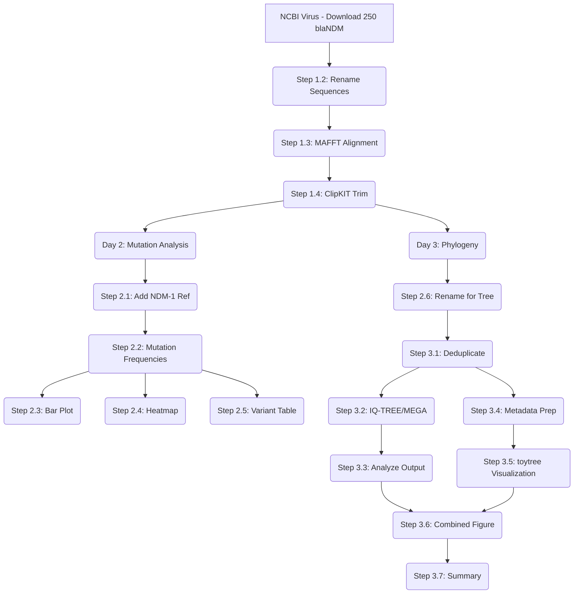

# blaNDM Analysis Pipeline — Mermaid Mindmap

```mermaid
graph TD
    A[NCBI Virus - Download 250 blaNDM] --> B(Step 1.2: Rename Sequences)
    B --> C(Step 1.3: MAFFT Alignment)
    C --> D(Step 1.4: ClipKIT Trim)
    D --> E(Day 2: Mutation Analysis)
    E --> F(Step 2.1: Add NDM-1 Ref)
    F --> G(Step 2.2: Mutation Frequencies)
    G --> H(Step 2.3: Bar Plot)
    G --> I(Step 2.4: Heatmap)
    G --> J(Step 2.5: Variant Table)
    D --> K(Day 3: Phylogeny)
    K --> L(Step 2.6: Rename for Tree)
    L --> M(Step 3.1: Deduplicate)
    M --> N(Step 3.2: IQ-TREE/MEGA)
    N --> O(Step 3.3: Analyze Output)
    M --> P(Step 3.4: Metadata Prep)
    P --> Q(Step 3.5: toytree Visualization)
    O --> R(Step 3.6: Combined Figure)
    Q --> R
    R --> S(Step 3.7: Summary)
```
